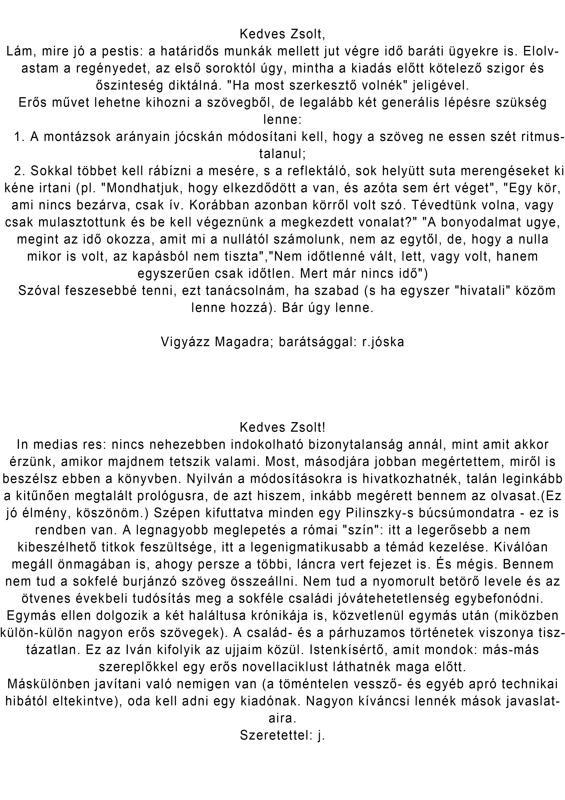
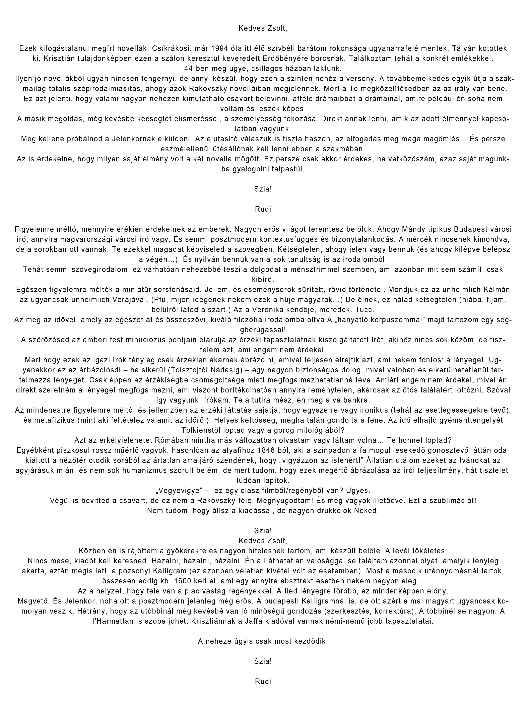

<!DOCTYPE html>
<html lang="hu">
    <head>
        <meta charset="utf-8" />
        <meta name="viewport" content="width=device-width, initial-scale=1, shrink-to-fit=no" />
        <meta name="BTK" content="" />
        <meta name="Bánki Tamás" content="" />
        <title>Sorozatok Az Üdvtörténetből</title>
        <!-- Favicon-->
        <link rel="icon" type="image/x-icon" href="assets/img/1.jpg" />
        <!-- Font Awesome icons (free version)-->
        
        <!-- Google fonts-->
        <link href="https://fonts.googleapis.com/css?family=Montserrat:400,700" rel="stylesheet" type="text/css" />
        <link href="https://fonts.googleapis.com/css?family=Lato:400,700,400italic,700italic" rel="stylesheet" type="text/css" />
        <!-- Core theme CSS (includes Bootstrap)-->
        <link href="css/styles.css" rel="stylesheet" />
    </head>
    <body id="page-top">
        <!-- Navigation-->
        <nav class="navbar navbar-expand-lg bg-secondary text-uppercase fixed-top" id="mainNav">
            

                <a class="navbar-brand js-scroll-trigger" href="#page-top">Epizódok az üdvtörténetből</a>
                <button class="navbar-toggler navbar-toggler-right text-uppercase font-weight-bold bg-primary text-white rounded" type="button" data-toggle="collapse" data-target="#navbarResponsive" aria-controls="navbarResponsive" aria-expanded="false" aria-label="Toggle navigation">
                    Menu
                    <i class="fas fa-bars"></i>
                </button>
                

                    <ul class="navbar-nav ml-auto">
                        <li class="nav-item mx-0 mx-lg-1"><a class="nav-link py-3 px-0 px-lg-3 rounded js-scroll-trigger" href="#portfolio">Olvasói vélemények</a></li>
                        <li class="nav-item mx-0 mx-lg-1"><a class="nav-link py-3 px-0 px-lg-3 rounded js-scroll-trigger" href="#about">Leírás</a></li>
                        <li class="nav-item mx-0 mx-lg-1"><a class="nav-link py-3 px-0 px-lg-3 rounded js-scroll-trigger" href="#contact">Kapcsolat</a></li>
                    </ul>
                

            

        </nav>
        <!-- Masthead-->
        <header class="masthead bg-primary text-black text-center">
            

                <!-- Masthead Avatar Image-->
                
                <!-- Masthead Heading-->
                <h1 class="masthead-heading text-uppercase mb-0">Kicsi hűség </h1>
                <!-- Icon Divider-->
                

                    

                    
<i class="fas fa-star"></i>

                    

                

                <!-- Masthead Subheading-->
                
Bánki Zsolt - Családregény 

            

        </header>
        <!-- Olvasói vélemények Section-->
        <section class="page-section portfolio" id="portfolio">
            

                <!-- Portfolio Section Heading-->
                <h2 class="page-section-heading text-center text-uppercase text-secondary mb-0">Olvasói vélemények</h2>
                <!-- Icon Divider-->
                

                    

                    
<i class="fas fa-star"></i>

                    

                

                <!-- Portfolio Grid Items-->
                

                    <!-- Portfolio Item 1-->
                    

                        

                            

                                
<i class="fas fa-plus fa-3x"></i>

                            

                            
                        

                    

                    <!-- Portfolio Item 2-->
                    

                        

                            

                                
<i class="fas fa-plus fa-3x"></i>

                            

                            
                        

                    

                    
                    <!-- Portfolio Item 6-->
                    

                        

                            

                                
<i class="fas fa-plus fa-3x"></i>

                            

                            
                        

                    

                

            

        </section>
        <!-- About Section-->
        <section class="page-section bg-primary text-white mb-0" id="about">
            

                <!-- About Section Heading-->
                <h2 class="page-section-heading text-center text-uppercase text-white">Leírás</h2>
                <!-- Icon Divider-->
                

                    

                    
<i class="fas fa-star"></i>

                    

                

                <!-- About Section Content-->
                

                    

A családregény jellegzetesen polgári műfaj; a nemzedékek egymást követő sorstörténete egyben polgárságtörténet, melyben a feltörekvés, a konszolidáció és a hanyatlás korszakai követik egymást.

                    

Mindez egyben értéktörténet is; a megvalósított és végül elherdált-megtagadott értékek annak a „protestáns etikának” a jegyében állnak, melyet Max Weber a polgári identitás alapjának tekintett

                

                <!-- About Section Button-->
                

                                    

                    <a class="btn btn-xl btn-outline-light" href="https://drive.google.com/file/d/1AocIWkwDVr0jsw-dxa09FqjXvRyEcZ8t/view">
                        <i class="fas fa-download mr-2"></i>
                        Letöltés!
                    </a>
                

            

        </section>
        <!-- Contact Section-->
        <section class="page-section" id="contact">
            

                <!-- Contact Section Heading-->
                <h2 class="page-section-heading text-center text-uppercase text-secondary mb-0">Kapcsolat</h2>
                <!-- Icon Divider-->
                

                    

                    
<i class="fas fa-star"></i>

                    

                

              <!-- Portfolio Modals-->
        <!-- Portfolio Modal 1-->
        

            

                

                    <button class="close" type="button" data-dismiss="modal" aria-label="Close">
                        <i class="fas fa-times"></i>
                    </button>
                    

                        

                            

                                

                                    <!-- Portfolio Modal - Title-->
                                    <h2 class="portfolio-modal-title text-secondary text-uppercase mb-0" id="portfolioModal1Label">Kemény István</h2>
                                    <!-- Icon Divider-->
                                    

                                        

                                        
<i class="fas fa-star"></i>

                                        

                                    

                                    <!-- Portfolio Modal - Image-->
                                    
                                    <!-- Portfolio Modal - Text-->
                                    
                         
                                        

                                    <button class="btn btn-primary" data-dismiss="modal">
                                        <i class="fas fa-times fa-fw"></i>
                                        Bezár
                                    </button>
                                

                            

                        

                    

                

            

        

        <!-- Portfolio Modal 2-->
        

            

                

                    <button class="close" type="button" data-dismiss="modal" aria-label="Close">
                        <i class="fas fa-times"></i>
                    </button>
                    

                        

                            

                                

                                    <!-- Portfolio Modal - Title-->
                                    <h2 class="portfolio-modal-title text-secondary text-uppercase mb-0" id="portfolioModal2Label">Reményi József Tamás</h2>
                                    <!-- Icon Divider-->
                                    

                                        

                                        
<i class="fas fa-star"></i>

                                        

                                    

                                    <!-- Portfolio Modal - Image-->
                                    
                                    <!-- Portfolio Modal - Text-->
                                    

             >

                                    <button class="btn btn-primary" data-dismiss="modal">
                                        <i class="fas fa-times fa-fw"></i>
                                        Bezár
                                    </button>
                                

                            

                        

                    

                

            

        

         <!-- Portfolio Modal 6-->
        

            

                

                    <button class="close" type="button" data-dismiss="modal" aria-label="Close">
                        <i class="fas fa-times"></i>
                    </button>
                    

                        

                            

                                

                                    <!-- Portfolio Modal - Title-->
                                    <h2 class="portfolio-modal-title text-secondary text-uppercase mb-0" id="portfolioModal6Label">Ungváry Rudolf</h2>
                                    <!-- Icon Divider-->
                                    

                                        

                                        
<i class="fas fa-star"></i>

                                        

                                    

                                    <!-- Portfolio Modal - Image-->
                                    
                                    <!-- Portfolio Modal - Text-->
                                    

                               
                                    <button class="btn btn-primary" data-dismiss="modal">
                                        <i class="fas fa-times fa-fw"></i>
                                        Bezár
                                    </button>
                                

                            

                        

                    

                

            

        

        <!-- Bootstrap core JS-->
        
        
        <!-- Third party plugin JS-->
        
        <!-- Contact form JS-->
        
        
        <!-- Core theme JS-->
        
    </body>
</html>
